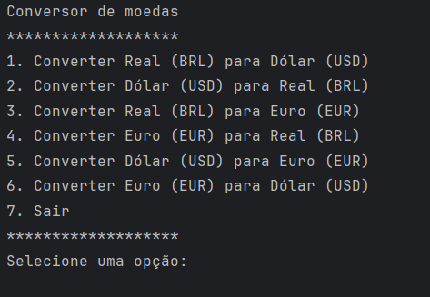

# Conversor de Moedas Java

## Índice
1. [Descrição do Projeto](#descrição-do-projeto)
2. [Status do Projeto](#status-do-projeto)
3. [Funcionalidades e Demonstração da Aplicação](#funcionalidades-e-demonstração-da-aplicação)
4. [Acesso ao Projeto](#acesso-ao-projeto)
5. [Tecnologias Utilizadas](#tecnologias-utilizadas)
6. [Pessoas Contribuidoras](#pessoas-contribuidoras)
7. [Pessoas Desenvolvedoras do Projeto](#pessoas-desenvolvedoras-do-projeto)
8. [Licença](#licença)

## Descrição do Projeto
O projeto é um conversor de moedas desenvolvido em Java. Permite ao usuário selecionar uma opção de conversão através de um menu apresentado no terminal e inserir o valor a ser convertido. Em seguida, o programa apresenta o valor convertido na moeda escolhida.

O programa utiliza uma API para fazer a conversão em tempo real. A API utilizada é [ExchangeRate API](https://app.exchangerate-api.com/).

Este exercício faz parte do desafio da trilha de formação Java do programa Alura-Oracle One.

## Status do Projeto
O projeto está em desenvolvimento.

## Funcionalidades e Demonstração da Aplicação
Em breve...

## Acesso ao Projeto
O código fonte do projeto está disponível em [repositório GitHub](https://github.com/mbraga2023/Alura---ConversorMoedas).

## Tecnologias Utilizadas
- Java
- API ExchangeRate

## Pessoas Contribuidoras
- [Alura](https://github.com/alura)

## Pessoas Desenvolvedoras do Projeto
- [Michel Braga](https://github.com/mbraga2023)

## Licença
Este projeto está licenciado sob a [Licença MIT](https://github.com/your/repository/blob/master/LICENSE).

